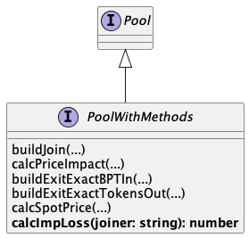

# Balancer Javascript SDK

A JavaScript SDK which provides commonly used utilties for interacting with Balancer Protocol V2.

## How to run the examples (Javascript)?

**In order to run the examples provided, you need to follow the next steps:**

1. git clone https://github.com/balancer-labs/balancer-sdk.git
2. cd balancer-sdk
3. cd balancer-js
4. Create a .env file in the balancer-js folder
5. In the .env file you will need to define and initialize the following variables

   We have defined both Alchemy and Infura, because some of the examples use Infura, others use Alchemy. However, feel free to modify accordingly and use your favourite one.
   ALCHEMY_URL=[ALCHEMY HTTPS ENDPOINT]  
   INFURA=[Infura API KEY]  
   TRADER_KEY=[MetaMask PRIVATE KEY]  
   Some examples also require the following Tenderly config parameters to be defined:
   TENDERLY_ACCESS_KEY=[TENDERLY API ACCESS KEY]
   TENDERLY_PROJECT=[TENDERLY PROJECT NAME]
   TENDERLY_USER=[TENDERLY USERNAME]

6. Run 'npm run node', this runs a local Hardhat Network
7. Open a new terminal
8. cd to balancer-js
9. Install ts-node using: npm install ts-node
10. Install tsconfig-paths using: npm install --save-dev tsconfig-paths
11. Run one of the provided examples (eg: npm run examples:run -- examples/join.ts)

## Installation

## Getting Started

```js
import { BalancerSDK, BalancerSdkConfig, Network } from '@balancer-labs/sdk';

const config: BalancerSdkConfig = {
  network: Network.MAINNET,
  rpcUrl: `https://mainnet.infura.io/v3/${process.env.INFURA}`,
};
const balancer = new BalancerSDK(config);
```

In some examples we present a way to make end to end trades against mainnet state. To run them you will need to setup a localhost test node using tools like ganache, hardhat, anvil.

Installation instructions for:

- [Hardhat](https://hardhat.org/getting-started/#installation)

  To start a MAINNET forked node:

  - Set env var: `ALCHEMY_URL=[ALCHEMY HTTPS ENDPOINT for MAINNET]`
  - Run: `npm run node`

  To start a GOERLI forked node:

  - Set env var: `ALCHEMY_URL_GOERLI=[ALCHEMY HTTPS ENDPOINT for GOERLI]`
  - Run: `npm run node:goerli`

- [Anvil](https://github.com/foundry-rs/foundry/tree/master/anvil#installation) - use with caution, still experimental.

  To start a forked node:

  ```
  anvil -f FORKABLE_RPC_URL (optional pinned block: --fork-block-number XXX)
  ```

## Swaps Module

Exposes complete functionality for token swapping. An example of using the module with data fetched from the subgraph:

```js
// Uses SOR to find optimal route for a trading pair and amount
const route = balancer.swaps.findRouteGivenIn({
  tokenIn,
  tokenOut,
  amount,
  gasPrice,
  maxPools,
});

// Prepares transaction attributes based on the route
const transactionAttributes = balancer.swaps.buildSwap({
  userAddress,
  swapInfo: route,
  kind: 0, // 0 - givenIn, 1 - givenOut
  deadline,
  maxSlippage,
});

// Extract parameters required for sendTransaction
const { to, data, value } = transactionAttributes;

// Execution with ethers.js
const transactionResponse = await signer.sendTransaction({ to, data, value });
```

## SwapsService

The SwapsService provides function to query and make swaps using Balancer V2 liquidity.

```js
const swaps = new swapService({
  network: Network;
  rpcUrl: string;
});
```

## Examples

You can run each example with `npm run examples:run -- examples/exampleName.ts`

### #queryBatchSwap

The Balancer Vault provides a [method to simulate a call to batchSwap](https://github.com/balancer-labs/balancer-v2-monorepo/blob/master/pkg/vault/contracts/interfaces/IVault.sol#L644).
This function performs no checks on the sender or recipient or token balances or approvals. Note that this function is not 'view' (due to implementation details): the client code must explicitly execute eth_call instead of eth_sendTransaction.

@param batchSwap - BatchSwap information used for query.
@param batchSwap.kind - either exactIn or exactOut.
@param batchSwap.swaps - sequence of swaps.
@param batchSwap.assets - array contains the addresses of all assets involved in the swaps.
@returns Returns an array with the net Vault asset balance deltas. Positive amounts represent tokens (or ETH) sent to the Vault, and negative amounts represent tokens (or ETH) sent by the Vault. Each delta corresponds to the asset at the same index in the `assets` array.

```js
swaps.queryBatchSwap(batchSwap: {
    kind: SwapType,
    swaps: BatchSwapStep[],
    assets: string[]
}): Promise<BigNumberish[]>
```

[Example](./examples/queryBatchSwap.ts)

### #queryBatchSwapWithSor

Uses SOR to create and query a batchSwap for multiple tokens in > multiple tokensOut.

@param queryWithSor - Swap information used for querying using SOR.
@param queryWithSor.tokensIn - Array of addresses of assets in.
@param queryWithSor.tokensOut - Array of addresses of assets out.
@param queryWithSor.swapType - Type of Swap, ExactIn/Out.
@param queryWithSor.amounts - Array of amounts used in swap.
@param queryWithSor.fetchPools - Set whether SOR will fetch updated pool info.
@returns Returns amount of tokens swaps along with swap and asset info that can be submitted to a batchSwap call.

```js
swaps.queryBatchSwapWithSor(queryWithSor: {
    tokensIn: string[],
    tokensOut: string[],
    swapType: SwapType,
    amounts: BigNumberish[],
    fetchPools: FetchPoolsInput;
}):
Promise<QueryWithSorOutput {
    returnAmounts: string[];
    swaps: BatchSwapStep[];
    assets: string[];
    deltas: string[];
}>
```

### #encodeBatchSwap

Static method to encode a [batch swap](https://dev.balancer.fi/references/contracts/apis/the-vault#batch-swaps).

_NB: This method doesn't execute a batchSwap -- it returns an [ABI byte string](https://docs.soliditylang.org/en/latest/abi-spec.html) containing the data of the function call on a contract, which can then be sent to the network (ex. [sendTransaction](https://web3js.readthedocs.io/en/v1.2.11/web3-eth.html#sendtransaction)). to be executed. See example for more info._

```js
/**
 * @param {BatchSwap}           batchSwap - BatchSwap information used for query.
 * @param {SwapType}            batchSwap.kind - either exactIn or exactOut
 * @param {BatchSwapSteps[]}    batchSwap.swaps - sequence of swaps
 * @param {string[]}            batchSwap.assets - array contains the addresses of all assets involved in the swaps
 * @param {FundManagement}      batchSwap.funds - object containing information about where funds should be taken/sent
 * @param {number[]}            batchSwap.limits - limits for each token involved in the swap, where either the maximum number of tokens to send (by passing a positive value) or the minimum amount of tokens to receive (by passing a negative value) is specified
 * @param {string}              batchSwap.deadline -  time (in Unix timestamp) after which it will no longer attempt to make a trade
 * @returns {string}            encodedBatchSwapData - Returns an ABI byte string containing the data of the function call on a contract
*/
Swaps.encodeBatchSwap(batchSwap: {
    kind: SwapType,
    swaps: BatchSwapStep[],
    assets: string[],
    funds: FundManagement,
    limits: number[],
    deadline: string
}): string
```

[Example](./examples/batchSwap.ts)

### Swap Service: Flash Swaps

A [Flash Swap](https://dev.balancer.fi/resources/swaps/flash-swaps) is a special type of [batch swap](https://dev.balancer.fi/resources/swaps/batch-swaps) where the caller doesn't need to own or provide any of the input tokens -- the caller is essentially taking a "flash loan" (an uncollateralized loan) from the Balancer Vault. The full amount of the input token must be returned to the Vault by the end of the batch (plus any swap fees), however any excess of an output tokens can be sent to any address.

IMPORTANT: A "simple" flash swap is an arbitrage executed with only two tokens and two pools,
swapping in the first pool and then back in the second pool for a profit. For more
complex flash swaps, you will have to use batch swap directly.

Gotchas:

- Both pools must have both assets (tokens) for swaps to work
- No pool token balances can be zero
- If the flash swap isn't profitable, the internal flash loan will fail.

### #encodeSimpleFlashSwap

Static method to encode a simple flash swap [method for a batchSwap](https://dev.balancer.fi/resources/swaps/flash-swaps).

_NB: This method doesn't execute any swaps -- it returns an [ABI byte string](https://docs.soliditylang.org/en/latest/abi-spec.html) containing the data of the function call on a contract, which can then be sent to the network (ex. [sendTransaction](https://web3js.readthedocs.io/en/v1.2.11/web3-eth.html#sendtransaction)). to be executed. See example for more info._

```js
/**
 * @param {SimpleFlashSwapParameters}   params - BatchSwap information used for query.
 * @param {string}                      params.flashLoanAmount - initial input amount for the flash loan (first asset)
 * @param {string[]}                    params.poolIds - array of Balancer pool ids
 * @param {string[]}                    params.assets - array of token addresses
 * @param {string}                      params.walletAddress - array of token addresses
 * @returns {string}            encodedBatchSwapData - Returns an ABI byte string containing the data of the function call on a contract
*/
Swaps.encodeSimpleFlashSwap(simpleFlashSwap: {
    flashLoanAmount: string,
    poolIds: string[],
    assets: string[]
    walletAddress: string[]
}): string
```

[Example](./examples/flashSwap.ts)

### #querySimpleFlashSwap

Method to test if a simple flash swap is valid and see potential profits.

```js
/**
 * @param {SimpleFlashSwapParameters}   params - BatchSwap information used for query.
 * @param {string}                      params.flashLoanAmount - initial input amount for the flash loan (first asset)
 * @param {string[]}                    params.poolIds - array of Balancer pool ids
 * @param {string[]}                    params.assets - array of token addresses
 * @returns {Promise<{profits: Record<string, string>, isProfitable: boolean}>}       Returns an ethersjs transaction response
*/
swaps.querySimpleFlashSwap(batchSwap: {
    kind: SwapType,
    swaps: BatchSwapStep[],
    assets: string[]
}): string
```

[Example](./examples/querySimpleFlashSwap.ts)

## Pricing

Spot Price functionality allowing user to query spot price for token pair.

### calcSpotPrice

Find Spot Price for pair in specific pool.

```js
const balancer = new BalancerSDK(sdkConfig);
const pool = await balancer.pools.find(poolId);
const spotPrice = await pool.calcSpotPrice(
  ADDRESSES[network].DAI.address,
  ADDRESSES[network].BAL.address
);
```

### #getSpotPrice

Find Spot Price for a token pair - finds most liquid path and uses this as reference SP.

```js
const pricing = new Pricing(sdkConfig);
```

@param { string } tokenIn Token in address.
@param { string } tokenOut Token out address.
@param { SubgraphPoolBase[] } pools Optional - Pool data. Will be fetched via dataProvider if not supplied.
@returns { string } Spot price.

```js
async getSpotPrice(
    tokenIn: string,
    tokenOut: string,
    pools: SubgraphPoolBase[] = []
): Promise<string>
```

[Example](./examples/spotPrice.ts)

## Simulating pool joins and exists

The Balancer Vault provides a [method to simulate join or exit calls to a pool](https://github.com/balancer-labs/balancer-v2-monorepo/blob/master/pkg/standalone-utils/contracts/BalancerQueries.sol#L91).
These function allows you to perform a dry run before sending an actual transaction, without checking the sender / recipient or token balances / approvals. Note that this function is not 'view' (due to implementation details): the client code must explicitly execute `eth_call` instead of `eth_sendTransaction`.

### Simulating joins

There are two ways to join a pool:

1. `joinExactIn`: Joining the pool with known token amounts. This is the most commonly used method.
2. `joinExactOut`: Asking the pool for the expected liquidity when we know how much BPT we want back.

In this documentation, we will focus on the first method (`joinExactIn`) for joining a pool with known token amounts.

```js
const pool = await sdk.pools.find(poolId)
const maxAmountsIn = pool.tokenList.map((t) => forEachTokenSpecifyAmountYouWantToJoinWith)
const queryParams = pool.buildQueryJoinExactIn({ maxAmountsIn })
const response = await balancerContracts.balancerHelpers.queryJoin(...queryParams)
const { bptOut, amountsIn } = response
```

`response` will return:

* `bptOut`: The expected pool token amount returned by the pool.
* `amountsIn`: The same as maxAmountsIn

### Simulating exits

There are three ways to join a pool:

1. `exitToSingleToken`: Exiting liquidity to a single underlying token is the simplest method. However, if the amount of liquidity being exited is a significant portion of the pool's total liquidity, it may result in price slippage.
2. `exitProportionally`: Exiting liquidity proportionally to all pool tokens. This is the most commonly used method. However `ComposableStable` pool type doesn't support it.
3. `exitExactOut`: Asking the pool for the expected pool token amount when we know how much token amounts we want back.

In this example, we will focus on the first method (`exitProportionally`).

```js
const pool = await sdk.pools.find(poolId)
const queryParams = pool.buildQueryJoinExactIn({ bptIn })
const response = await balancerContracts.balancerHelpers.queryJoin(...queryParams)
const { bptIn, amountsOut } = response
```

`response` will return:

* `amountsOut`: Token amounts returned by the pool.
* `bptIn`: The same as intput bptIn

More examples: https://github.com/balancer-labs/balancer-sdk/blob/master/balancer-js/examples/pools/queries.ts

## Joining Pools

### Joining with pool tokens

Exposes Join functionality allowing user to join pools with its pool tokens.

```js
const balancer = new BalancerSDK(sdkConfig);
const pool = await balancer.pools.find(poolId);
const { to, functionName, attributes, data } = pool.buildJoin(params);
```

#### #buildJoin

Builds a join transaction.

```js
/**
 * @param { string }   joiner - Address used to exit pool.
 * @param { string[] } tokensIn - Token addresses provided for joining pool (same length and order as amountsIn).
 * @param { string[] } amountsIn - Token amounts provided for joining pool in EVM amounts.
 * @param { string }   slippage - Maximum slippage tolerance in bps i.e. 50 = 0.5%.
 * @returns { Promise<JoinPoolAttributes> } Returns join transaction ready to send with signer.sendTransaction.
*/
buildJoin: (
  joiner: string,
  tokensIn: string[],
  amountsIn: string[],
  slippage: string
) => Promise<JoinPoolAttributes>;
```

[Example](./examples/join.ts)

### Joining nested pools

Exposes Join functionality allowing user to join a pool that has pool tokens that are BPTs of other pools, e.g.:

```
                  CS0
              /        \
            CS1        CS2
          /    \      /   \
         DAI   USDC  USDT  FRAX

Can join with tokens: DAI, USDC, USDT, FRAX, CS1_BPT, CS2_BPT
```

```js
  /**
   * Builds generalised join transaction
   *
   * @param poolId          Pool id
   * @param tokens          Token addresses
   * @param amounts         Token amounts in EVM scale
   * @param userAddress     User address
   * @param wrapMainTokens  Indicates whether main tokens should be wrapped before being used
   * @param slippage        Maximum slippage tolerance in bps i.e. 50 = 0.5%.
   * @param authorisation   Optional auhtorisation call to be added to the chained transaction
   * @returns transaction data ready to be sent to the network along with min and expected BPT amounts out.
   */
  async generalisedJoin(
    poolId: string,
    tokens: string[],
    amounts: string[],
    userAddress: string,
    wrapMainTokens: boolean,
    slippage: string,
    authorisation?: string
  ): Promise<{
    to: string;
    callData: string;
    minOut: string;
    expectedOut: string;
  }>
```

[Example](./examples/joinGeneralised.ts)

## Exit Pool

Exposes Exit functionality allowing user to exit pools.

```js
const balancer = new BalancerSDK(sdkConfig);
const pool = await balancer.pools.find(poolId);
const { to, functionName, attributes, data } = pool.buildExitExactBPTIn(params);
```

### #buildExitExactBPTIn

Builds an exit transaction with exact BPT in and minimum token amounts out based on slippage tolerance.

```js
  /**
   * @param {string}  exiter - Account address exiting pool
   * @param {string}  bptIn - BPT provided for exiting pool
   * @param {string}  slippage - Maximum slippage tolerance in percentage. i.e. 0.05 = 5%
   * @param {string}  singleTokenMaxOut - Optional: token address that if provided will exit to given token
   * @returns         transaction request ready to send with signer.sendTransaction
   */
  buildExitExactBPTIn: (
    exiter: string,
    bptIn: string,
    slippage: string,
    singleTokenMaxOut?: string
  ) => Promise<ExitPoolAttributes>;
```

[Example](./examples/exitExactBPTIn.ts)

### #buildExitExactTokensOut

Builds an exit transaction with exact tokens out and maximum BPT in based on slippage tolerance.

```js
  /**
   * @param {string}    exiter - Account address exiting pool
   * @param {string[]}  tokensOut - Tokens provided for exiting pool
   * @param {string[]}  amountsOut - Amounts provided for exiting pool
   * @param {string}    slippage - Maximum slippage tolerance in percentage. i.e. 0.05 = 5%
   * @returns           transaction request ready to send with signer.sendTransaction
   */
  buildExitExactTokensOut: (
    exiter: string,
    tokensOut: string[],
    amountsOut: string[],
    slippage: string
  ) => Promise<ExitPoolAttributes>;
```

[Example](./examples/exitExactTokensOut.ts)

### Exiting nested pools

Exposes Exit functionality allowing user to exit a pool that has pool tokens that are BPTs of other pools, e.g.:

```
                  CS0
              /        \
            CS1        CS2
          /    \      /   \
         DAI   USDC  USDT  FRAX

Can exit with CS0_BPT proportionally to: DAI, USDC, USDT and FRAX
```

```js
/**
   * Builds generalised exit transaction
   *
   * @param poolId        Pool id
   * @param amount        Token amount in EVM scale
   * @param userAddress   User address
   * @param slippage      Maximum slippage tolerance in bps i.e. 50 = 0.5%.
   * @param authorisation Optional auhtorisation call to be added to the chained transaction
   * @returns transaction data ready to be sent to the network along with tokens, min and expected amounts out.
   */
  async generalisedExit(
    poolId: string,
    amount: string,
    userAddress: string,
    slippage: string,
    authorisation?: string
  ): Promise<{
    to: string;
    callData: string;
    tokensOut: string[];
    expectedAmountsOut: string[];
    minAmountsOut: string[];
  }>
```

[Example](./examples/exitGeneralised.ts)

## RelayerService

Relayers are (user opt-in, audited) contracts that can make calls to the vault (with the transaction “sender” being any arbitrary address) and use the sender’s ERC20 vault allowance, internal balance or BPTs on their behalf.

```js
const relayer = new relayerService(
    swapsService: SwapsService;
    rpcUrl: string;
);
```

### #swapUnwrapAaveStaticExactIn

Finds swaps for tokenIn>wrapped Aave static tokens and chains with unwrap to underlying stable. ExactIn - Exact amount of tokenIn to use in swap.

@param tokensIn - array to token addresses for swapping as tokens in.
@param aaveStaticTokens - array contains the addresses of the Aave static tokens that tokenIn will be swapped to. These will be unwrapped.
@param amountsIn - amounts to be swapped for each token in.
@param rates - The rate used to convert wrappedToken to underlying.
@param funds - Funding info for swap. Note - recipient should be relayer and sender should be caller.
@param slippage - Slippage to be applied to swap section. i.e. 5%=50000000000000000.
@param fetchPools - Set whether SOR will fetch updated pool info.
@returns Transaction data with calldata. Outputs.amountsOut has final amounts out of unwrapped tokens.

```js
async relayer.swapUnwrapAaveStaticExactIn(
    tokensIn: string[],
    aaveStaticTokens: string[],
    amountsIn: BigNumberish[],
    rates: BigNumberish[],
    funds: FundManagement,
    slippage: BigNumberish,
    fetchPools: FetchPoolsInput = {
        fetchPools: true,
        fetchOnChain: false
    }
): Promise<TransactionData>
```

[Example](./examples/relayerSwapUnwrap.ts)

### #swapUnwrapAaveStaticExactOut

Finds swaps for tokenIn>wrapped Aave static tokens and chains with unwrap to underlying stable. ExactOut - Exact amount of tokens out are used for swaps.

@param tokensIn - array to token addresses for swapping as tokens in.
@param aaveStaticTokens - array contains the addresses of the Aave static tokens that tokenIn will be swapped to. These will be unwrapped.
@param amountsUnwrapped - amounts of unwrapped tokens out.
@param rates - The rate used to convert wrappedToken to underlying.
@param funds - Funding info for swap. Note - recipient should be relayer and sender should be caller.
@param slippage - Slippage to be applied to swap section. i.e. 5%=50000000000000000.
@param fetchPools - Set whether SOR will fetch updated pool info.
@returns Transaction data with calldata. Outputs.amountsIn has the amounts of tokensIn.

```js
async relayer.swapUnwrapAaveStaticExactOut(
    tokensIn: string[],
    aaveStaticTokens: string[],
    amountsUnwrapped: BigNumberish[],
    rates: BigNumberish[],
    funds: FundManagement,
    slippage: BigNumberish,
    fetchPools: FetchPoolsInput = {
        fetchPools: true,
        fetchOnChain: false
    }
): Promise<TransactionData>
```

[Example](./examples/relayerSwapUnwrap.ts)

### #exitPoolAndBatchSwap

Chains poolExit with batchSwap to final tokens.

@param params:
@param exiter - Address used to exit pool.
@param swapRecipient - Address that receives final tokens.
@param poolId - Id of pool being exited.
@param exitTokens - Array containing addresses of tokens to receive after exiting pool. (must have the same length and order as the array returned by `getPoolTokens`.)
@param userData - Encoded exitPool data.
@param minExitAmountsOut - Minimum amounts of exitTokens to receive when exiting pool.
@param finalTokensOut - Array containing the addresses of the final tokens out.
@param slippage - Slippage to be applied to swap section. i.e. 5%=50000000000000000.
@param fetchPools - Set whether SOR will fetch updated pool info.
@returns Transaction data with calldata. Outputs.amountsOut has amounts of finalTokensOut returned.

```js
async relayer.exitPoolAndBatchSwap(
    params: ExitAndBatchSwapInput {
        exiter: string;
        swapRecipient: string;
        poolId: string;
        exitTokens: string[];
        userData: string;
        minExitAmountsOut: string[];
        finalTokensOut: string[];
        slippage: string;
        fetchPools: FetchPoolsInput;
    }
): Promise<TransactionData>
```

[Example](./examples/relayerExitPoolAndBatchSwap.ts)

### Pools Impermanent Loss

> DRAFT
> 
> impermanent loss (IL) describes the percentage by which a pool is worth less than what one would have if they had instead just held the tokens outside the pool


#### Service



#### Algorithm

Using the variation delta formula:


where **𝚫P<sup>i</sup>** represents the difference between the price for a single token at the date of joining the pool and the current price. 

```javascript

// retrieves pool's tokens
tokens = pool.tokens;
// get weights for tokens
weights = tokens.map((token) => token.weight);
// retrieves current price for tokens
exitPrices = tokens.map((token) => tokenPrices.find(token.address));
// retrieves historical price for tokens
entryPrices = tokens.map((token) => tokenPrices.findBy('timestamp', { address: token.address, timestamp: timestamp})); 
// retrieves list of pool's assets with prices delta and weights 
assets = tokens.map((token) => ({
  priceDelta: this.getDelta(entryPrices[token.address], exitPrices[token.address]),
  weight: weights[i],
}));

poolValueDelta = assets.reduce((result, asset) => result * Math.pow(Math.abs(asset.priceDelta + 1), asset.weight), 1);
holdValueDelta = assets.reduce((result, asset) => result + (Math.abs(asset.priceDelta + 1) * asset.weight), 0);

const IL = poolValueDelta/holdValueDelta - 1;
```

#### Usage

```javascript
async impermanentLoss(
  timestamp: number, // the UNIX timestamp from which the IL is desired
  pool: Pool // the pool on which the IL must be calculated
): Promise<number> 
```

```javascript
const pool = await sdk.pools.find(poolId);
const joins = (await sdk.data.findByUser(userAddress)).filter((it) => it.type === "Join" && it.poolId === poolId);
const join = joins[0];
const IL = await pools.impermanentLoss(join.timestamp, pool);  
```

[Example](./examples/pools/impermanentLoss.ts)


## Licensing

[GNU General Public License Version 3 (GPL v3)](../../LICENSE).
